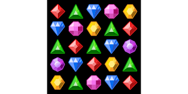

# 보석 게임 (Jewel Game)

## 🔗 게임 바로가기 (Play Game)

[https://kor-dsy.github.io/sillavibe_game/](https://kor-dsy.github.io/sillavibe_game/)

## 🎮 게임 설명

보석 게임은 제한 시간 내에 최대한 많은 점수를 획득하는 것이 목표인 간단한 퍼즐 게임입니다. 같은 모양의 보석을 3개 이상 맞춰 점수를 올리고, 특별한 조합으로 더 높은 점수에 도전해보세요!

## 🕹️ 게임 방법

1.  **보석 맞추기**: 인접한 두 개의 보석을 클릭하여 위치를 바꿀 수 있습니다.
2.  가로나 세로로 같은 모양의 보석이 3개 이상 모이면 보석이 사라지면서 점수를 얻습니다.
3.  **특수 보석**:
    *   **4개 맞추기**: 보석 4개를 한 줄로 맞추면 해당 줄 전체가 사라집니다.
    *   **5개 맞추기**: 보석 5개를 한 줄로 맞추면 강력한 **폭탄**이 생성됩니다.
4.  **폭탄 사용**: 생성된 폭탄을 클릭하면 해당 위치의 가로, 세로줄이 모두 터집니다.

## ✨ 특징

*   **제한 시간**: 60초 동안 최고의 점수를 기록해야 합니다.
*   **콤보 시스템**: 연속으로 보석을 맞추면 콤보가 쌓여 추가 점수를 획득할 수 있습니다.
*   **실시간 랭킹**: 상위 10명의 점수가 리더보드에 표시됩니다. 1위의 점수와 내 점수 차이를 확인하며 경쟁할 수 있습니다.
*   **랭킹 초기화**: 랭킹은 매시간 정각에 초기화되어 새로운 도전을 할 수 있습니다.

## 📈 게임 구조 (Game Structure)

## 🛠️ 기술 스택

*   HTML
*   CSS
*   JavaScript

## 발표 자료 주소
* 
